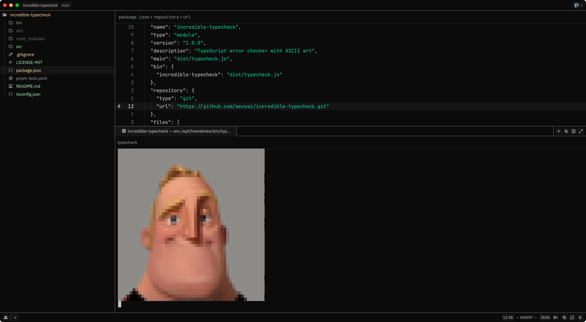
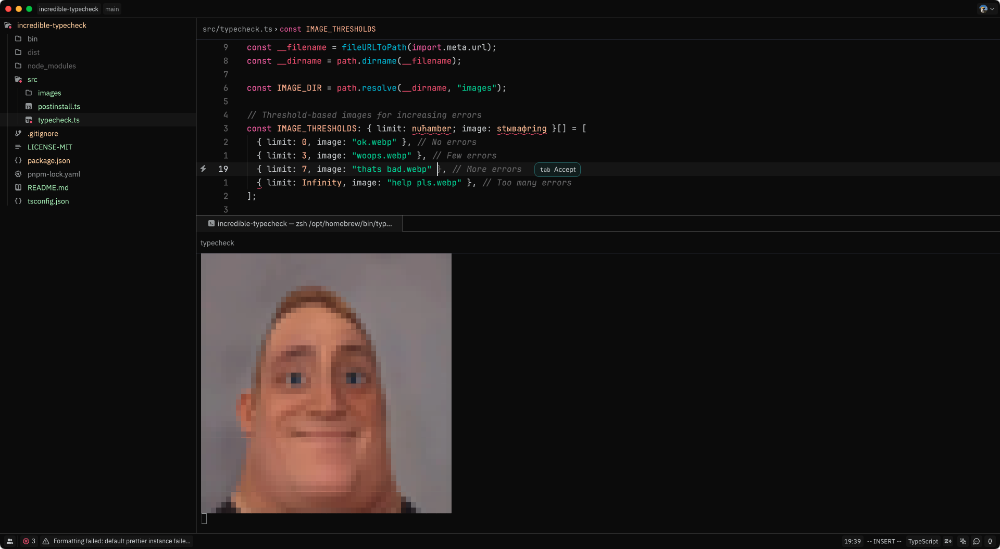
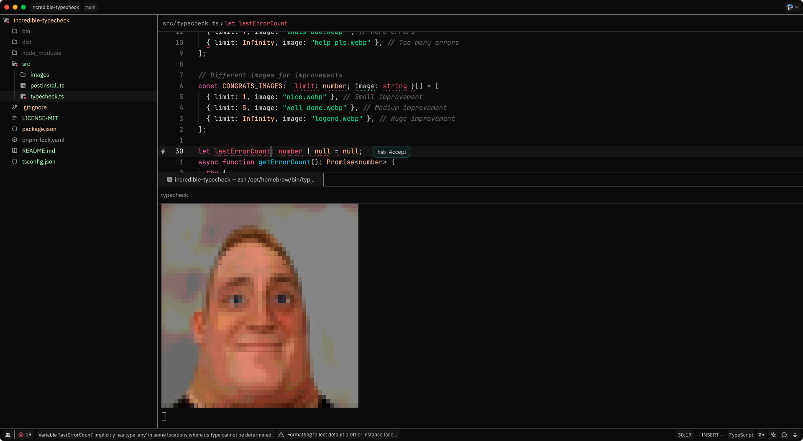
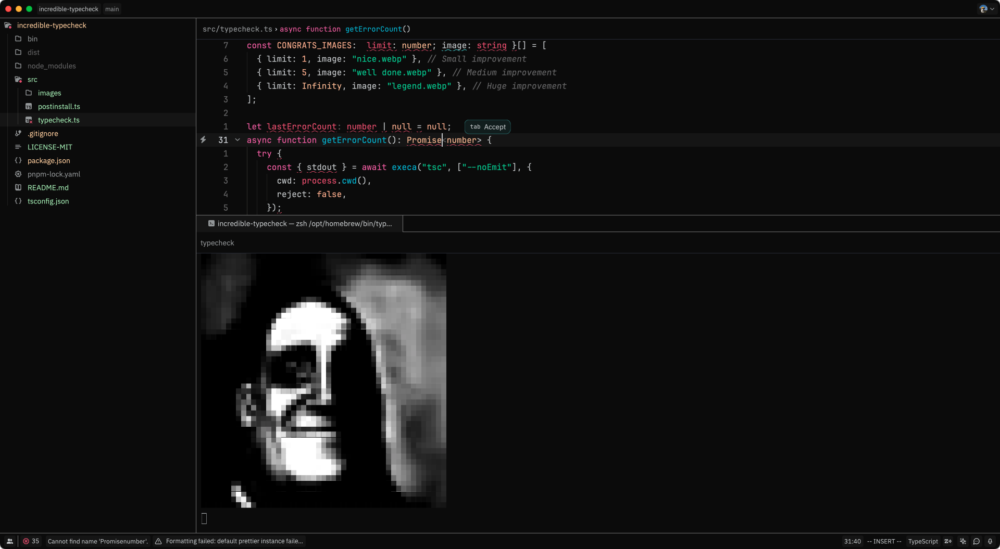

Here’s a fun and engaging README for your incredible-typecheck project! 🚀

🤯 incredible-typecheck 🚀

	“Your TypeScript errors just got a whole lot more visual!” 🎨💀

📢 What is this?!

Are you tired of boring old TypeScript errors?
Do you want your terminal to SCREAM at you with ASCII art whenever you mess up?
Do you like dynamic, Git-powered thresholds that make your mistakes feel even worse?

Then incredible-typecheck is here to judge your code.

🔥 Features

✅ Watches your TypeScript project like an overprotective parent.
✅ Counts your type errors (and reminds you of your sins).
✅ Displays dramatic images based on how bad things are.
[ ] Uses Git history to tell you if you’re getting worse.
[ ] Congratulates you with 🎉 when you fix stuff (rare).

📦 Installation and usage

```bash
npm install -g incredible-typecheck
incredible-typecheck
```

🚀 Now watch in horror as:
	•	Your type errors increase → You get scarier images. 👻
	•	Your errors decrease → You get a happy surprise! 🎉
	•	You ignore errors → The program judges you silently.

📷 Image-Based Motivation System

Error Count	What Happens?
0	🎉 You get a nice image. Life is good. 
1-3	⚠️ A mild warning. You should fix it. 
4-7	🔥 Things are getting spicy. 
8+	💀 Your code is cursed. 

🛠️ Advanced Features

🎭 Adaptive Error Thresholds
	•	Uses your Git history to calculate error trends.
	•	Sets smart thresholds based on past commits.
	•	If your errors increase, it lets you know (aggressively).

🤔 Why Did You Make This?

Because TypeScript errors shouldn’t just be painful—they should also be funny.
If I’m going to ruin my day, I want an ASCII image to go with it.

Hope this gives your project a fun and unique personality! Let me know if you want any tweaks. 😆🚀
